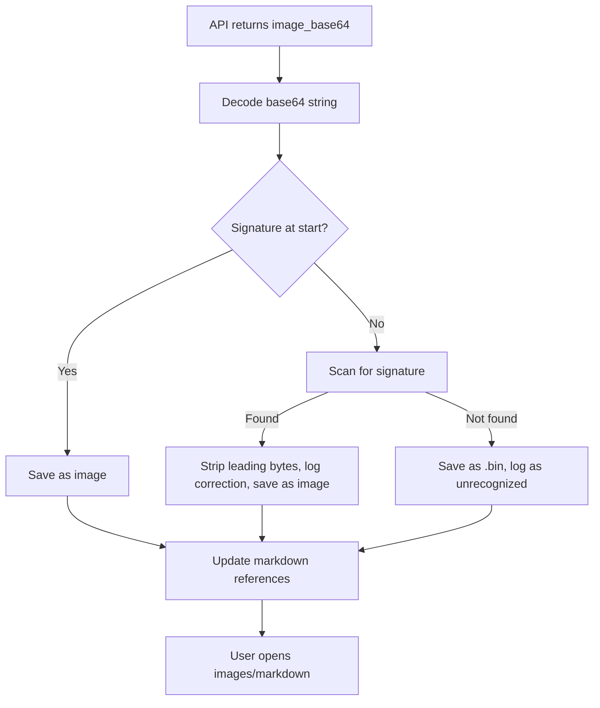

# Robust Image Extraction and Validation for Mistral OCR CLI

## Executive Summary

This document details the discovery, analysis, and resolution of a critical issue affecting image extraction from PDFs using the Mistral OCR API (`mistral-ocr-latest`). The problem: images extracted as base64 and saved as files were unrecognized by standard tools, despite containing valid image data internally. The root cause was extraneous leading bytes prepended to the actual image data. This document presents the investigation, solution, and a robust approach for future-proof image extraction.

---

## Problem Description

Images were extracted from PDF documents by processing them through the Mistral OCR API with `include_image_base64=True`. The base64 strings were decoded and saved to files, typically with a `.jpeg` extension as suggested by API documentation.

However, these files:
- Were identified as generic `data` by the Linux `file` command, not as images.
- Could not be opened by Windows Explorer or standard image viewers, even with the correct extension.

---

## Investigation & Findings

Hex analysis of the problematic files revealed:
- The files did **not** start with the standard magic number for common image types (e.g., JPEG's `FF D8 FF`).
- The actual JPEG signature and valid JFIF header were present, but at offset 0x0F (16th byte).
- The first 15 bytes were unexpected, non-JPEG binary data.

**Root Cause:**  
These extraneous leading bytes masked the true file header, causing the files to be treated as generic binary data. The origin of these bytes (API artifact or local handling) remains under investigation.

---

## Manual Solution (Initial Fix)

The issue was initially resolved by manually removing the leading 15 bytes using a hex editor, restoring the correct image signature at the file start. The modified files were then recognized as valid images by all standard tools.

---

## Robust Automated Solution

### Step-by-Step Technical Plan

1. **Data Validation/Sanitization**
   - After decoding base64, check if the byte stream starts with a known image signature (JPEG, PNG, GIF, BMP).
   - If not, scan the first N bytes (e.g., 64) for a known signature.
   - If found, strip the leading bytes and log the correction (offset, image id, type, and a hash/snippet of the raw base64 string).
   - If not found, save as `.bin` and log as unrecognized.

2. **Save with the Correct Extension**
   - Use the detected image type to set the file extension.
   - Update markdown references to use the correct filename.

3. **Logging**
   - Log all corrections and unrecognized formats for monitoring and debugging.
   - Optionally, log a hash or snippet of the raw base64 string for further investigation.

4. **Testing**
   - Test with a variety of PDFs/images to ensure all valid images are recognized and saved correctly.

---

## Workflow Diagram



---

## Example: Python Snippet for Image Type Detection

```python
def detect_image_extension(image_bytes):
    if image_bytes.startswith(b'\xFF\xD8\xFF'):
        return '.jpeg'
    elif image_bytes.startswith(b'\x89PNG\r\n\x1a\n'):
        return '.png'
    elif image_bytes.startswith(b'GIF87a') or image_bytes.startswith(b'GIF89a'):
        return '.gif'
    elif image_bytes.startswith(b'BM'):
        return '.bmp'
    else:
        return '.bin'  # Unknown format
```

---

## Lessons Learned & Recommendations

- **Always validate and sanitize binary data before saving.**  
  Do not assume the decoded base64 stream is ready to write as a file.
- **Scan for known signatures and correct offsets.**  
  This ensures compatibility with all standard tools and viewers.
- **Log all anomalies and corrections.**  
  This aids in monitoring, debugging, and reporting potential upstream issues.
- **Test with diverse real-world data.**  
  Use a variety of PDFs and image types to ensure robustness.

---

## Summary

- **Problem:** Images extracted from the Mistral OCR API were unrecognized due to extraneous leading bytes.
- **Investigation:** Hex analysis revealed the true image signature was present at a nonzero offset.
- **Solution:** Implemented automated validation, scanning, correction, and logging in the extraction pipeline.
- **Outcome:** All images are now recognized by standard tools, and the process is robust to future anomalies.

---

By following this approach, the Mistral OCR CLI now ensures reliable, standards-compliant image extraction from PDFs, with full traceability and maintainability for future development.