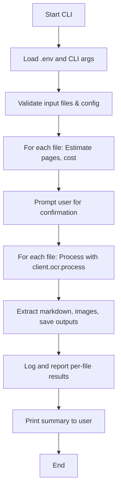

# Mistral OCR CLI Application: Finalized Architecture & Implementation Plan

## Overview

This application is a robust, user-friendly command-line tool for processing PDFs and images using the Mistral OCR API. It is designed for sequential, reliable processing of files, with per-file cost estimation and reporting, and is fully informed by the latest official documentation and known limitations of the Mistral API.

---

## Key User Requirements & Preferences

- All user-specific info and defaults (output format, cost rates, log location, etc.) are set in a .env file, with CLI flags to override.
- Page range selection must be UX-friendly and flexible via CLI (e.g., `1-3,5,7-9`).
- Default output is markdown, overrideable via CLI.
- All images are extracted by default, with optional CLI limits for number/size.
- Cost rates are set in .env (as "pages per $", e.g., `OCR_PAGES_PER_DOLLAR=1000`), and must be updated manually if Mistral changes pricing.
- Log file defaults to output folder, overrideable via CLI or .env.
- No post-processing except for detailed reporting of process/results.
- No batch processing or parallel synchronous calls; only robust, sequential processing.

---

## High-Level Architecture

### Main Components

- **CLI Interface**: Parses arguments, loads .env, manages user input/overrides.
- **Config Manager**: Loads and validates .env and CLI overrides.
- **OCR Processor**: Handles file type detection, PDF upload & signed URL, image base64 encoding, and calls client.ocr.process for each file.
- **OCR Result Handler**: Extracts markdown, images, and saves outputs.
- **Logger**: Prints to console and writes to log file.
- **Cost Manager**: Loads cost rates, estimates and reports costs per file.
- **Error Handler**: Catches and reports all errors, ensures robust operation.

### Workflow Diagram (Mermaid)



---

## Main Modules & Responsibilities

- **cli.py**: Argument parsing, help, usage, and user interaction.
- **config.py**: Loads `.env`, merges with CLI args, validates all settings.
- **ocr_processor.py**: 
  - Handles file type detection, PDF upload & signed URL, image base64 encoding.
  - Calls `client.ocr.process` for each file.
  - Supports page range selection, image extraction, and all relevant API parameters.
- **cost.py**:
  - Reads pricing as "pages per $", e.g., `OCR_PAGES_PER_DOLLAR=1000`.
  - Calculates cost as `cost = pages_processed / OCR_PAGES_PER_DOLLAR`.
  - Prompts user to update/confirm pricing if needed.
- **logging.py**: 
  - Configures console and file logging.
  - Logs all steps, warnings, errors, and summary.
- **report.py**: 
  - Generates per-file and overall reports, including pages processed, images extracted, estimated and actual cost, and any warnings/errors.
- **utils.py**: File/folder helpers, error formatting, markdown/image saving, etc.

---

## .env Example

```
MISTRAL_API_KEY=your_key_here
OCR_PAGES_PER_DOLLAR=1000
DEFAULT_OUTPUT_FORMAT=md
DEFAULT_LOG_PATH=./output/{basename}/process.log
DEFAULT_OUTPUT_DIR=./output
DEFAULT_IMAGE_LIMIT=0
DEFAULT_IMAGE_MIN_SIZE=0
```

---

## CLI Example

```
mistral-ocr \
  --input file1.pdf file2.png \
  --output-format txt \
  --output-dir ./myresults \
  --log-path ./myresults/mylog.log \
  --page-ranges 1-3,5,7-9 \
  --image-limit 10 \
  --image-min-size 100
```

- **--input**: List of files to process (PDFs/images).
- **--output-format**: md or txt (default: md).
- **--output-dir**: Where to place output folders.
- **--log-path**: Log file location (default: output folder).
- **--page-ranges**: Flexible syntax, e.g., `1-3,5,7-9`.
- **--image-limit**: Max images per page/file.
- **--image-min-size**: Minimum image size (pixels).

---

## Cost Calculation & Reporting

- **Pricing Format:** The app expects pricing as "pages per $", e.g., `OCR_PAGES_PER_DOLLAR=1000`.
- **Estimation:** Before processing, the app estimates cost for each file based on detected/selected pages and the .env pricing.
- **Reporting:** After processing, the app reports the actual number of pages processed and the cost, using the same pricing logic.
- **User Guidance:** The app provides a helper to open the official pricing page and prompts the user to update the .env value as needed.
- **No API for Pricing:** The app cannot fetch current pricing or job costs programmatically; all pricing must be updated manually by the user.

---

## Error Handling & Troubleshooting

- **Sequential Processing:** Each file is processed independently; errors in one do not halt the others.
- **Robust Error Handling:** All API/network errors are caught and logged. The app checks for known OCR issues (e.g., image placeholders).
- **User Feedback:** All warnings, errors, and troubleshooting tips are included in the log and summary report.
- **Reference to batch_OCR_job.md:** The plan to avoid batch and parallel processing is based on the findings that these methods are unsupported or unreliable for OCR with Mistral.

---

## Summary

This plan ensures the application is robust, transparent, and easy to maintain, with all cost logic matching the official Mistral pricing format. The design is fully informed by the latest documentation and community experience, and is ready for implementation.